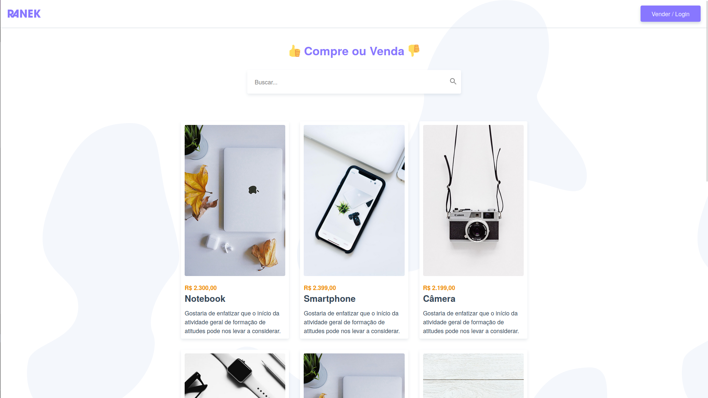

<h1 align="center"> Ranek Shop - Vue.js 2 Origamid</h1>

<p align="center">
Projeto de loja virtual com consulta API Rest WordPress
</p>

<br>

<p align="center">
  
</p>

## 🚀 Tecnologias

Esse projeto foi desenvolvido com as seguintes tecnologias:

- [Vue.js](https://vuejs.org/)
- [Vuex](https://vuex.vuejs.org/)
- [Vue Router](https://router.vuejs.org/)
- [Axios](https://axios-http.com/ptbr/)
- [JWT Authentication for WP REST API](https://wordpress.org/plugins/jwt-authentication-for-wp-rest-api/)

## 💻 Projeto

O Ranek Shop é uma SPA que simula uma loja virtual, onde é possível criar conta, fazer login, adicionar, comprar, vender e deletar produtos, utilizando para isso a reatividade do Vue.js + consumo de REST API do WordPress.

## 🔖 Source

O projeto faz parte do curso de Vue.js 2 completo ofertado pela Origamid, e pode ser consultado [ATRAVÉS DESTE LINK](https://www.origamid.com/curso/vue-js-completo).

<br /><br/>

<h1 align="center"> Setup Fron-end & Back-end</h1>

## 🔥 Front-end

Instale as dependências do projeto:

```
npm install
```

Rode a aplicação:

```
npm run dev
```

ou

```
npm run build
```

## 🔐 Backend

O back-end para o projeto funcionar é feito em WordPress, que precisa ser instalado e configurado localmente para poder fornecer os endpoints da API. A base de instalação/configuraçestá disponível [NESTE REPOSITÓRIO](https://github.com/reinaldonunes/OrigamidCursos/tree/main/wordpress_rest_api).

<br /><br /><br />

<h4 align="center">
 
  <br />
  Feito com ♥ no Ubuntu 22.04 LTS
</h1>
